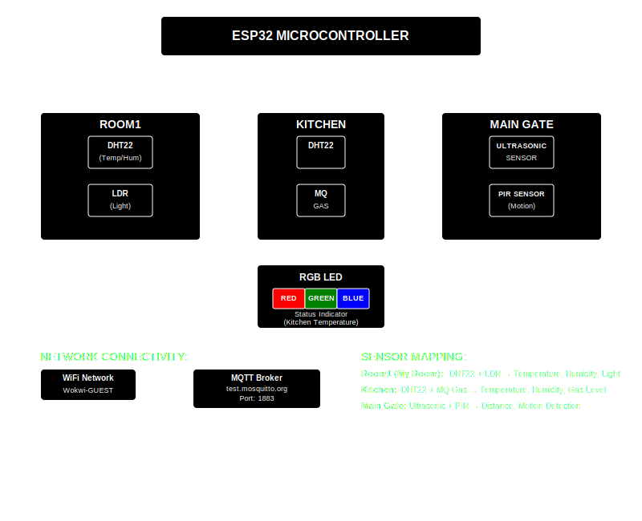
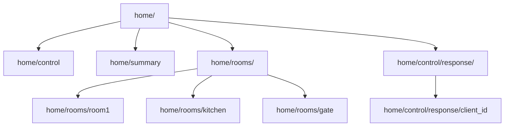

## MQTT-Wokwi-Simulation

Simulating **Message Queuing Telemetry Transport (MQTT)** Protocol using [Wokwi](https://wokwi.com/) Simulator and Mosquitto Broker.


<details open>
<summary><b>📦 Setup Environment</b></summary>

- Download and Install [Mosquitto](https://mosquitto.org/download/) Broker for Windows.

- Add Mosquitto to PATH. Default Installation Directory for Mosquitto is:
    ```text
    C:\Program Files\mosquitto
    ```

- Now, Open **Notepad as Administrator** and Save the following in the above directory by the name **mosquitto.conf** file.
    ```text
    listener 1883 0.0.0.0
    protocol MQTT
    allow_anonymous true
    log_type all
    log_dest file C:\Program Files\mosquitto\mosquitto.log
    ```
- Verify Installation with `mosquitto -v`.

- Check for Mosquitto Subscriber and Publisher with `mosquitto_sub --version` or `mosquitto_pub --version`.

- Stop **Mosquitto Broker** service in **Services.msc**, if you get an error and re-check `mosquitto -v`.

- Test Basic Connection:
    ```text
    mosquitto_sub -h test.mosquitto.org -t test/connect
    mosquitto_pub -h test.mosquitto.org -t test/connect -m "Hello MQTT!"
    ```
</details>

<details open>
<summary><b>🤖 Circuit Layout and Topics</b></summary>

<br>

<center>
    
</center>

- For complete circuit diagrams and pin connections, refer to [CONNECTIONS.md](./docs/Connections.md).

### Base Topic: `home/`



### Control Commands

| Command | Action | Required Fields | Description | Response Topic | Example JSON |
|---------|--------|-----------------|-------------|----------------|--------------|
| **Subscribe** | `subscribe` | `client_id`, `rooms` | Subscribe client to specific rooms | `home/control/response/{client_id}` | `{"action": "subscribe", "client_id": "C-01", "rooms": ["room1", "kitchen"]}` |
| **Unsubscribe** | `unsubscribe` | `client_id`, `rooms` | Unsubscribe client from specific rooms | `home/control/response/{client_id}` | `{"action": "unsubscribe", "client_id": "C-01", "rooms": ["room1"]}` |
| **Disconnect** | `disconnect` | `client_id` | Disconnect client from all rooms | `home/control/response/{client_id}` | `{"action": "disconnect", "client_id": "C-01"}` |
| **Status** | `status` | `client_id` | Get client subscription status | `home/control/response/{client_id}` | `{"action": "status", "client_id": "C-01"}` |

</details>

<details open>
    <summary>🤔 How to Run?</summary>

- First, Go to Wokwi and Open [Basic ESP32 Project](https://wokwi.com/projects/new/esp32).

- **Create New File** named `main.py`.

- From the repository, use the `diagram.json` and `main.py`.

- **Run the code in Wokwi**.

- Meanwhile, open **Command Prompt** and **Subscribe to Topics** to view messages.


### Commands to Test Simulation

1. **Monitor all Topics.**
    ```cmd
    mosquitto_sub -h test.mosquitto.org -t "home/#" -v
    ```

2. **Monitor Specific Topics**.
- Monitor Control Messages
    ```cmd
    mosquitto_sub -h test.mosquitto.org -t "home/control/#" -v
    ```

- Monitor Room Readings
    ```cmd
    mosquitto_sub -h test.mosquitto.org -t "home/rooms/#" -v
    ```

- Monitor System Summary
    ```cmd
    mosquitto_sub -h test.mosquitto.org -t "home/summary" -v
    ```

3. **Subscribe Client to Rooms**
- Subscribe C-01 to gate only
    ```cmd
    mosquitto_pub -h test.mosquitto.org -t "home/control" -m "{\"action\": \"subscribe\", \"client_id\": \"C-01\", \"rooms\": [\"gate\"]}"
    ```

- Subscribe C-02 to all rooms
    ```cmd
    mosquitto_pub -h test.mosquitto.org -t "home/control" -m "{\"action\": \"subscribe\", \"client_id\": \"client3\", \"rooms\": [\"room1\", \"kitchen\", \"gate\"]}"
    ```

4. **Monitor Client Status**
    ```cmd
    mosquitto_pub -h test.mosquitto.org -t "home/control" -m "{\"action\": \"status\", \"client_id\": \"C-01\"}"
    ```

5. **Unsubscribe Client from Rooms**
- Remove client2 from multiple rooms
    ```cmd
    mosquitto_pub -h test.mosquitto.org -t "home/control" -m "{\"action\": \"unsubscribe\", \"client_id\": \"C-02\", \"rooms\": [\"kitchen\", \"gate\"]}"
    ```

6. **Disconnect Client**
    ```cmd
    mosquitto_pub -h test.mosquitto.org -t "home/control" -m "{\"action\": \"disconnect\", \"client_id\": \"C-01\"}"
    ```

6. **Monitor Specific Room Data**
- Monitor room1 readings
    ```cmd
    mosquitto_sub -h test.mosquitto.org -t "home/rooms/room1" -v
    ```

- Monitor kitchen readings  
    ```cmd
    mosquitto_sub -h test.mosquitto.org -t "home/rooms/kitchen" -v
    ```

- Monitor gate readings
    ```cmd
    mosquitto_sub -h test.mosquitto.org -t "home/rooms/gate" -v
    ```
</details>