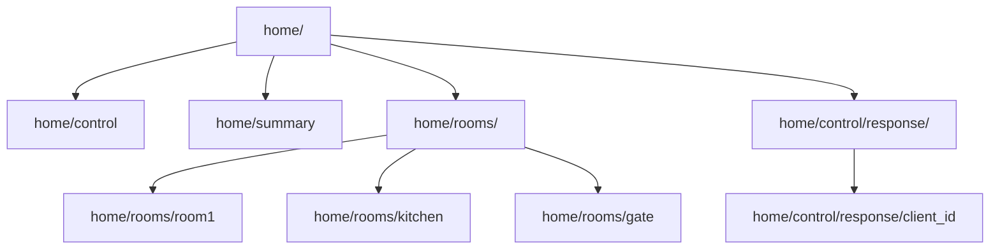

## MQTT-Wokwi-Simulation

Simulating **Message Queuing Telemetry Transport (MQTT)** Protocol using [Wokwi](https://wokwi.com/) Simulator and Mosquitto Broker.


<details open>
<summary><b>📦 Setup Environment</b></summary>

- Download and Install [Mosquitto](https://mosquitto.org/download/) Broker for Windows.

- Add Mosquitto to PATH. Default Installation Directory for Mosquitto is:
    ```text
    C:\Program Files\mosquitto
    ```

- Now, Open **Notepad as Administrator** and save the following in the above directory by the name **mosquitto.conf** file.
    ```text
    listener 1883 0.0.0.0
    protocol MQTT
    allow_anonymous true
    log_type all
    log_dest file C:\Program Files\mosquitto\mosquitto.log
    ```
- Verify Installation with `mosquitto -v`.

- Check for Mosquitto Subscriber and Publisher with `mosquitto_sub --version` or `mosquitto_pub --version`.

- Stop **Mosquitto Broker** service in **Services.msc**, if you get an error and re-check `mosquitto -v`.

- Test Basic Connection:
    ```text
    mosquitto_sub -h test.mosquitto.org -t test/connect
    mosquitto_pub -h test.mosquitto.org -t test/connect -m "Hello MQTT!"
    ```
</details>

<details open>
<summary><b>🤖 Circuit Layout and Topics</b></summary>

<br>

```text
┌─────────────────────────────────────────────────────────────────────────────┐
│                          ESP32 MICROCONTROLLER                              │
└─────────────────────────────────────────────────────────────────────────────┘
                                      │
                    ┌─────────────────┼──────────────────┐
                    │                 │                  │
        ┌───────────▼──────────┐  ┌───▼─────┐  ┌─────────▼─────────┐
        │        ROOM1         │  │ KITCHEN │  │     MAIN GATE     │
        │   ┌─────────────┐    │  │ ┌─────┐ │  │ ┌─────────────┐   │
        │   │    DHT22    │    │  │ │DHT22│ │  │ │ ULTRASONIC  │   │
        │   │ (Temp/Hum)  │    │  │ │     │ │  │ │   SENSOR    │   │
        │   └─────────────┘    │  │ └─────┘ │  │ └─────────────┘   │
        │                      │  │         │  │                   │
        │   ┌─────────────┐    │  │ ┌─────┐ │  │ ┌─────────────┐   │
        │   │     LDR     │    │  │ │ MQ  │ │  │ │ PIR SENSOR  │   │
        │   │  (Light)    │    │  │ │ GAS │ │  │ │  (Motion)   │   │
        │   └─────────────┘    │  │ └─────┘ │  │ └─────────────┘   │
        └──────────────────────┘  └─────────┘  └───────────────────┘

                              ┌───────────────────┐
                              │      RGB LED      │
                              │                   │
                              │ ┌─────┬─────┬────┐│
                              │ │ RED │GREEN│BLUE││
                              │ └─────┴─────┴────┘│
                              └───────────────────┘
                                Status Indicator
                              (Kitchen Temperature)

NETWORK CONNECTIVITY:
┌──────────────────┐          ┌─────────────────────────┐
│   WiFi Network   │◄────────►│      MQTT Broker        │
│   Wokwi-GUEST    │          │   test.mosquitto.org    │
└──────────────────┘          │      Port: 1883         │
                              └─────────────────────────┘

SENSOR MAPPING:

Room1 (My Room):     DHT22 + LDR → Temperature, Humidity, Light
Kitchen:             DHT22 + MQ Gas → Temperature, Humidity, Gas Level  
Main Gate:           Ultrasonic + PIR → Distance, Motion Detection
```

- For complete circuit diagrams and pin connections, refer to [Connections.md](./docs/Connections.md).

### Base Topic: `home/`



### Control Commands

| Command | Action | Required Fields | Description | Response Topic | Example JSON |
|---------|--------|-----------------|-------------|----------------|--------------|
| **Subscribe** | `subscribe` | `client_id`, `rooms` | Subscribe client to specific rooms | `home/control/response/{client_id}` | `{"action": "subscribe", "client_id": "C-01", "rooms": ["room1", "kitchen"]}` |
| **Unsubscribe** | `unsubscribe` | `client_id`, `rooms` | Unsubscribe client from specific rooms | `home/control/response/{client_id}` | `{"action": "unsubscribe", "client_id": "C-01", "rooms": ["room1"]}` |
| **Disconnect** | `disconnect` | `client_id` | Disconnect client from all rooms | `home/control/response/{client_id}` | `{"action": "disconnect", "client_id": "C-01"}` |
| **Status** | `status` | `client_id` | Get client subscription status | `home/control/response/{client_id}` | `{"action": "status", "client_id": "C-01"}` |

</details>