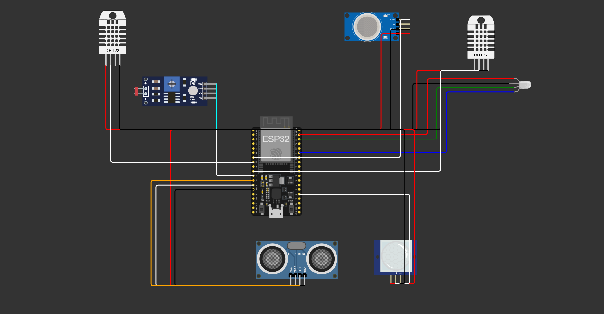
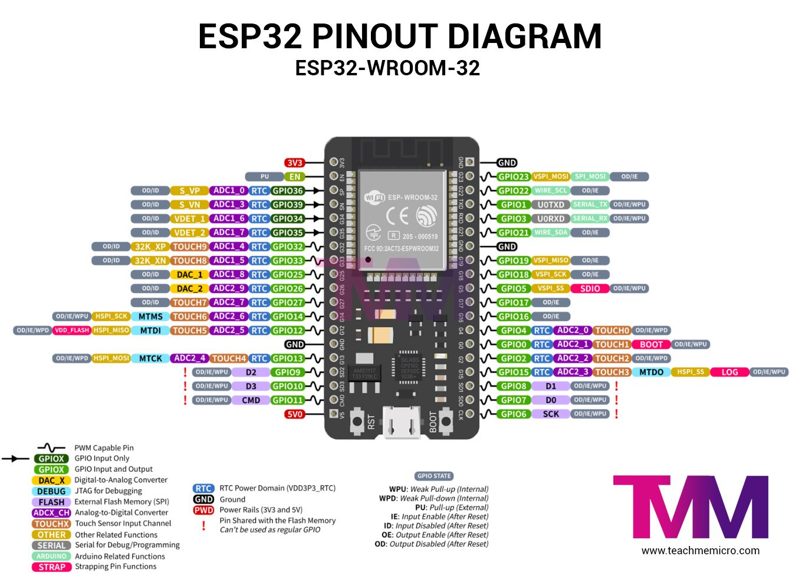

## Connections

- This is the circuit layout for our simulation.
    

        
    

- Pin connections are as follows:

    **Digital Sensors**

    | Sensor | Component | ESP32 Pin | Pin Name |
    |--------|-----------|-----------|----------|
    | DHT22 (Room1) | dht1 | GPIO 33 | SDA |
    | DHT22 (Kitchen) | dht2 | GPIO 26 | SDA |
    | PIR Motion Sensor | pir1 | GPIO 2 | OUT |
    | Ultrasonic HC-SR04 | ultrasonic1 | GPIO 12 | TRIG |
    | Ultrasonic HC-SR04 | ultrasonic1 | GPIO 14 | ECHO |

    **Analog Sensors**

    | Sensor | Component | ESP32 Pin | Pin Name |
    |--------|-----------|-----------|----------|
    | LDR (Light Sensor) | ldr1 | GPIO 34 | AO |
    | Gas Sensor (MQ) | gas1 | GPIO 32 | AOUT |

    **Output Devices**

    | Device | Component | ESP32 Pin | Pin Name |
    |--------|-----------|-----------|----------|
    | RGB LED | rgb1 | GPIO 22 | G |
    | RGB LED | rgb1 | GPIO 23 | R |
    | RGB LED | rgb1 | GPIO 21 | B |

    **Power Connections**

    | Component | ESP32 Pin | Pin Name |
    |-----------|-----------|----------|
    | All Sensors VCC | 3V3 | VCC |
    | All Sensors GND | GND.1/GND.2 | GND |
    | RGB LED COM | GND.2 | COM |

- Pin Diagram for ESP32 for reference:
    

        
    
